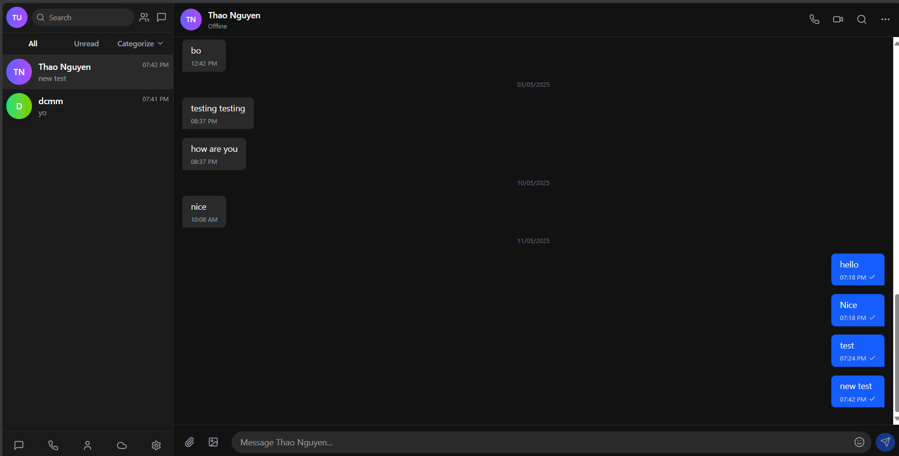
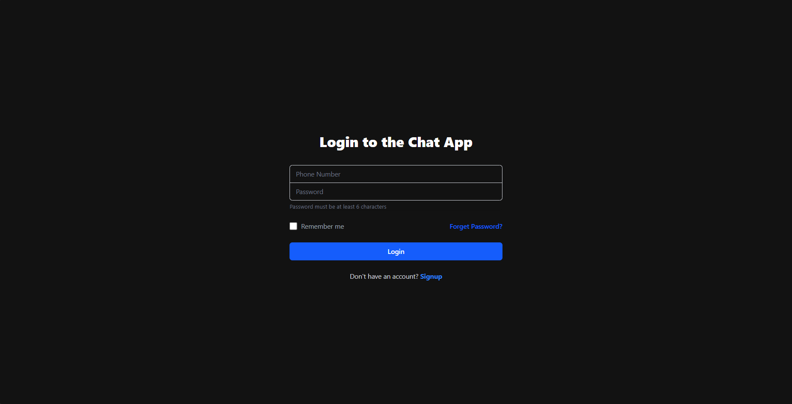
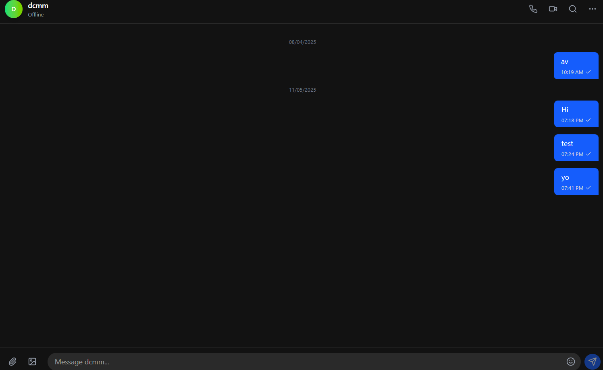
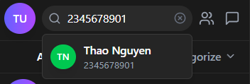

# WebSocket Chat Application

A real-time chat application built with WebSockets, featuring a React TypeScript frontend and Spring Boot Java backend.



## Features

- **Real-time Messaging**: Instant message delivery using WebSockets
- **User Authentication**: Secure login and registration system
- **Conversation Management**: Create and manage multiple conversations
- **Message History**: Access and view message history
- **User Search**: Find users by phone number
- **Online Status**: See which users are currently online
- **Responsive Design**: Works on desktop and mobile devices
- **Message Categories**: Organize conversations by category (work, family, friends)

## Tech Stack

### Frontend

- React + TypeScript
- Tailwind CSS
- Vite
- SockJS and StompJS for WebSocket communication
- Axios for HTTP requests
- Lucide React for icons
- React Toastify for notifications

### Backend

- Java 21
- Spring Boot 3.4
- Spring WebSocket
- Spring Security with JWT authentication
- MongoDB for data storage
- Project Lombok
- MapStruct

## Getting Started

### Prerequisites

- Node.js (v18+)
- npm or yarn
- Java Development Kit (JDK) 21
- MongoDB

### Installation

#### Backend Setup

1. Clone the repository

```bash
git clone https://github.com/yourusername/Final-Chat-App.git
cd Final-Chat-App/web-socket-chat-app-backend
```

2. Configure MongoDB connection in `application.properties`

3. Build and run the backend

```bash
./mvnw spring-boot:run
```

#### Frontend Setup

1. Navigate to the frontend directory

```bash
cd ../web-socket-chat-app-frontend
```

2. Install dependencies

```bash
npm install
```

3. Start the development server

```bash
npm run dev
```

4. Access the application at `http://localhost:5173`

### Docker Setup (Optional)

The application can be run using Docker:

```bash
cd Final-Chat-App
docker-compose up
```

## Project Structure

### Frontend Structure

```
web-socket-chat-app-frontend/
├── src/
│   ├── components/     # Reusable UI components
│   ├── pages/          # Main application pages
│   ├── services/       # API and WebSocket services
│   ├── types/          # TypeScript type definitions
│   ├── assets/         # Static assets
│   └── App.tsx         # Main application component
```

### Backend Structure

```
web-socket-chat-app-backend/
├── src/
│   ├── main/
│   │   ├── java/com/chat_app/web_socket_chat_application/
│   │   │   ├── api/           # REST controllers and DTOs
│   │   │   ├── app/           # Services and exceptions
│   │   │   ├── config/        # Configuration classes
│   │   │   ├── domain/        # Domain entities and repositories
│   │   │   └── mapper/        # Object mappers
│   │   └── resources/         # Application properties
│   └── test/                  # Test classes
```

## Screenshots

### Login Page



### Chat Interface



### User Search

Search user using name (only works for those already connected) or phone number


## License

This project is licensed under the MIT License - see the LICENSE file for details.
